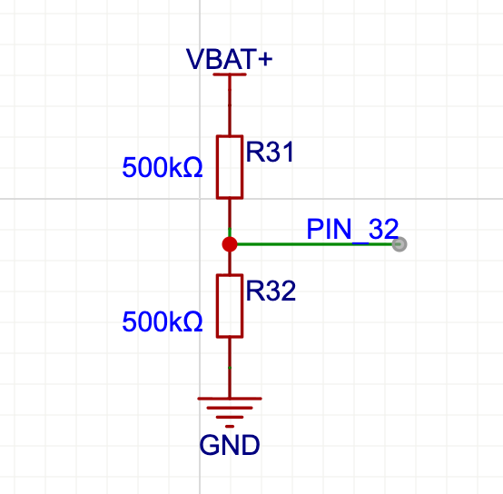
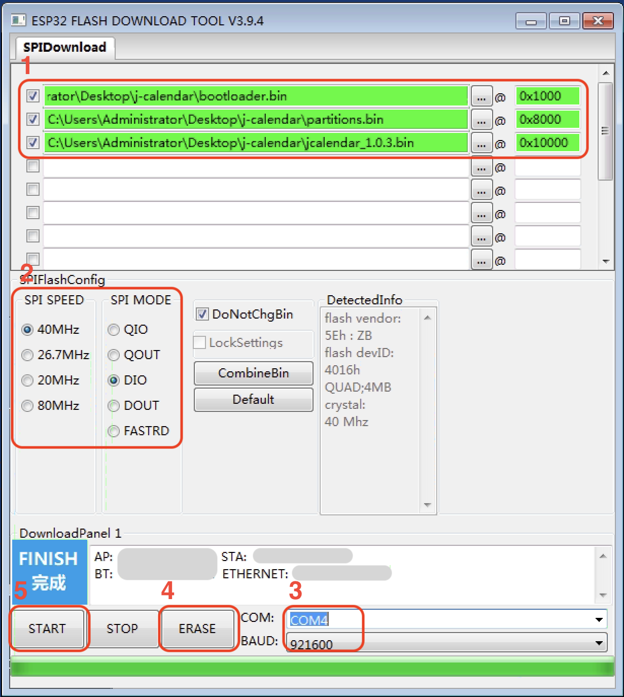

# 五邑大学课程表 wyu-jcalendar

 

> 基于 [JADE-Jerry/jcalendar](https://github.com/JADE-Jerry/jcalendar) **1.1.9** 版本魔改，原作者保留所有权利。

4.2 寸三色墨水屏低功耗月历，支持农历、天气、倒计日、课程表。**本版新增学习通（超星）Cookie 自动获取课程表**，适用于五邑大学及其他使用学习通的高校。


<br>


## 功能特性

- 📅 月历展示（农历、节气、公休假、节日）
- 🌤 和风天气（每日天气 / 实时天气）
- 📝 倒计日
- 📖 **课程表（学习通自动获取 + 手动输入）**
- 🔋 电池电量检测
- 📶 WiFi 配置 + OTA 升级
- ⏰ 低功耗休眠，续航可达数月

## 材料清单

1. ESP32 开发板（建议 LOLIN32 Lite，其他 ESP32 开发板亦可）
2. 4.2 寸三色墨水屏（400×300）
3. 通用墨水屏驱动板
4. 锂电池（PH2.0 接头，推荐 603048 900mAh，带保护板）
5. 3D打印外壳（95×80mm）
6. 轻触开关（12×12×7.3，带键帽）
7. 工具：电烙铁、电线若干

## 接线说明

**墨水屏驱动板：**

| 屏幕引脚 | ESP32 引脚 |
|---------|-----------|
| Busy | 4 |
| RST | 16 |
| DC | 17 |
| CS | 5 |
| SCK | 18 |
| SDA | 23 |
| GND | GND |
| VCC | 3V |

**其他：**

| 功能 | ESP32 引脚 |
|------|-----------|
| 按钮 | 14, GND |
| LED（板载） | 22 |
| 电池 ADC | 32 |

> ⚠️ 三色墨水屏排线插入时注意针脚方向，屏幕排线和驱动板排线 1 号针脚均是悬空，注意对齐。

> ⚠️ 电池接口需要 PH2.0，注意正负极（开发板上有标注）。如果正负极反了，可以用镊子调整电池插头。

**电池电压检测（可选）：** 通过两个相同的大电阻（建议 500K 以上）串联分压检测电池电压。



## 烧录固件

使用 ESP32 烧录工具 [Flash Download Tools](https://www.espressif.com/en/support/download/other-tools?keys=flash+download+tools) 烧录固件：

1. 选择烧录文件和地址（bootloader.bin 与 partitions.bin 烧录过一次后不需要重复烧录）
2. 选择 Flash 配置信息
3. 选择串口及波特率（可根据实际情况调整）
4. 擦除 Flash
5. 开始烧录

> ⚠️ 文件前面一定要打勾，否则不会刷进 flash！



**固件选择参考：**

| 丝印 | 固件 |
|------|------|
| P420010 | 1680 |
| E042A43-A0 | z98 |
| A13600** | z21 |

大部分较新的屏选 1680，拆机屏选 z98，SES 拆机屏选 z21。实在不确定就三个都试一遍。

## 按键操作

| 操作 | 系统状态 | 功能 |
|------|---------|------|
| 单击 | 休眠中 | 唤醒系统，刷新月历 |
| 单击 | 运行中 | 强制刷新 / 切换日历与课程表 |
| 双击 | 运行中 | 进入系统配置（同时停止 WiFi 操作） |
| 双击 | 配置中 | 重启系统 |
| 长按 | 运行中 | 清除配置信息（WiFi 密钥除外）和缓存，重启 |

## LED 指示灯

（板载 LED，PIN-22）

| 状态 | 含义 |
|------|------|
| 快闪（约 2 次/秒） | 系统启动中，正在连接 WiFi |
| 常亮 | WiFi 连接完成 |
| 慢闪（1 次/2 秒） | WiFi 连接失败（10 秒后休眠） |
| 三短闪一长灭 | 系统配置中（3 分钟超时休眠） |
| 熄灭 | 系统休眠 |

## WiFi 配置

在系统运行状态下（LED 常亮）双击按键进入配置状态，系统会生成名为 **J-Calendar** 的热点，默认密码：`password`（超时时间 180 秒）。

连接热点后浏览器会自动弹出配置页面，或手动访问 `http://192.168.4.1`。

### 配置项

**1. WiFi 配置** — 选择热点并输入密码保存。

**2. 系统配置：**

- **周首日**：0 = 周日（默认），1 = 周一
- **和风天气**：
  - 输入 API Key 和城市 ID（[城市 ID 列表](./assets/file/China-City-List-latest.csv)），支持经纬度格式（如 `116.41,39.92`）
  - 天气类型：0 = 每日天气（默认），1 = 实时天气
  - API Key 置空则不刷新天气
  - 2025 年 3 月后注册的账户需额外配置 API Host
- **倒数日**：输入名称（≤4 个中文字符）和日期（yyyyMMdd），名称为空则不显示
- **日期 Tag**：格式 `yyyyMMddx`，x 为图标（a=书签，b=金钱，c=笑脸，d=警告），最多 3 个，分号隔开
- **课程表**：详见下方

### 课程表配置

#### 推荐方式：学习通 CK 自动获取课程表

**告别手动输入课程！** 只需在配置页面填入学习通 Cookie（CK），设备每次唤醒时自动调用学习通 API 拉取本周课程。

**工作原理：**
1. 设备唤醒 → 连接 WiFi
2. 自动调用学习通 API 获取本周课程数据
3. 解析课程信息（时间、地点、教师）
4. 在墨水屏上显示课程表

**优势：**
- ✅ **零手动输入**：填入 CK 后完全自动
- ✅ **实时更新**：每周自动获取最新课程
- ✅ **兼容性强**：与原版手动课程表共存
- ✅ **容错设计**：CK 失效时可回退手动模式

**获取 CK 步骤：**

1. 手机安装 [Alook 浏览器](https://www.alookweb.com/)（iOS / Android 均可）
2. 打开 Alook，访问 [学习通网页版](https://passport.chaoxing.com/) 并登录
3. 登录成功后，点击底部菜单 **工具箱** → **开发者工具** → **Cookies**
4. 找到并复制完整的 Cookie 字符串（即 CK）
5. 在设备配置页面「课程表」配置项中粘贴 CK
6. 重启设备，自动拉取本周课程

> ⚠️ Cookie 有效期有限，失效后需重新获取并更新。

#### 备用方式：手动输入

分多段输入，用英文分号 `;` 隔开：

1. **课程数段**：三位数字，分别代表上午、下午、晚上课程数。如 `430` = 上午 4 课，下午 3 课，晚上无课
2. **每日课程**：首位为星期数，后接课程名，英文逗号分隔。如 `二,数学,语文,英语,体育,音乐,德法,`
3. **完整示例**：
   ```
   430;一,语文,数学,体育,美术,科学,综合;二,数学,语文,英语,体育,音乐,德法;三,数学,英语,科学,语文,体育,书法,音乐;四,语文,数学,信息,劳动,德法,体育;五,英语,语文,数学,美术,心理,体育;
   ```

> ⚠️ 分隔符必须使用英文符号 `,` 和 `;`，不可用中文符号。

**3. OTA 升级** — 通过浏览器访问配置页面，选择固件文件上传。

**4. 重启** — 配置完成后重启生效（也可双击按键重启）。

**5. 系统信息** — 查看硬件状态、清除 WiFi 密钥。

**6. 退出** — 退出配置状态。

## 测试工具

### test_chaoxing_ck.py

独立的 Python 脚本，用于在电脑上快速验证学习通 Cookie（CK）是否有效、能否正常获取课程表数据。

**用途：** 在烧录固件前，先用这个脚本确认你的 CK 能拉到课程，避免在设备上反复调试。

**使用方法：**

```bash
python test_chaoxing_ck.py
```

运行后粘贴学习通 Cookie，脚本会自动获取当前周课程并输出标准格式，结果同时保存到桌面 `schedule_output.txt`。

## 常见问题

**Q: 刷完机后没有反应？**
A: 观察 PIN-22 LED 是否闪烁。有闪烁说明固件已刷入，尝试按重置按钮或拔插电源。也可通过串口工具查看启动日志。

**Q: 刷完机后如何配置？**
A: 在系统运行状态下（LED 常亮或慢闪）双击按键进入配置状态，LED 变为三短闪一长灭即进入成功。

**Q: 课程表和日历如何切换？**
A: 在系统运行状态下（LED 常亮）单击按键即可切换。

**Q: 充一次电能用多久？**
A: 以 900mAh 电池、每日刷新一次为例，休眠电流约 120μA，刷新一次约 1.6mAh，理论待机约半年。实际取决于开发板和电池质量。

**Q: 待机时间很短？**
A: 部分开发板或驱动板休眠功耗可达 2mA，会严重影响待机。建议增加电池检测电路监控电量。

**Q: 填了学习通 CK 但没有获取到课程？**
A: 请确认 CK 未过期（学习通 Cookie 有效期较短，建议定期更新）。设备需在 WiFi 连接成功后才会拉取课程。

## 外壳

3D 打印，PLA 或 ABS 均可。[下载模型](./assets/file/E-ink%20box2%20v22.3mf)

## License

[GPL-3.0](./LICENSE)

## Reference

1. [WEMOS LOLIN32 簡介](https://swf.com.tw/?p=1331&cpage=1)
2. [GxEPD2](https://github.com/ZinggJM/GxEPD2)
3. [U8g2_for_Adafruit_GFX](https://github.com/olikraus/U8g2_for_Adafruit_GFX)
4. [和风天气](https://dev.qweather.com/docs/api/weather/weather-now/)
